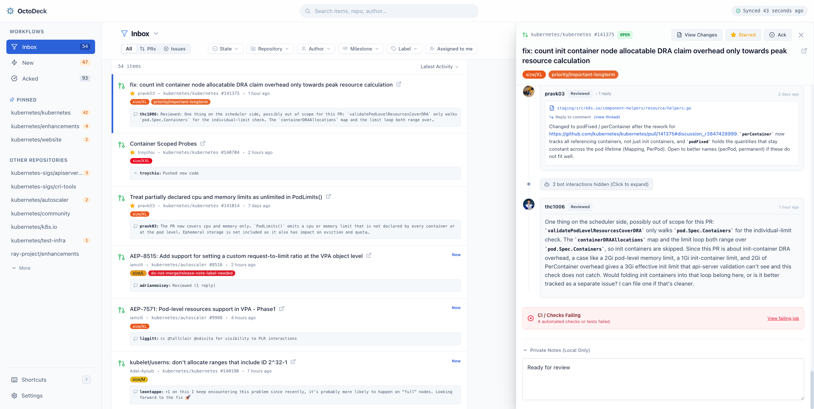
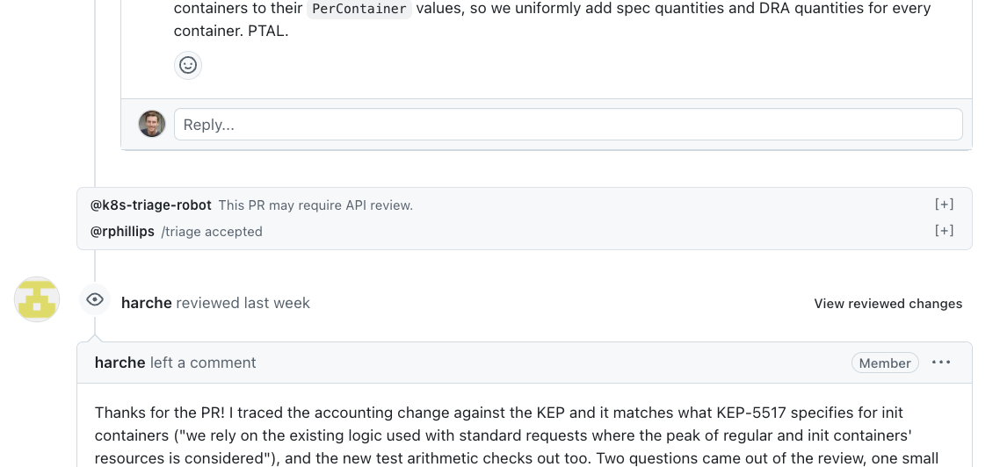
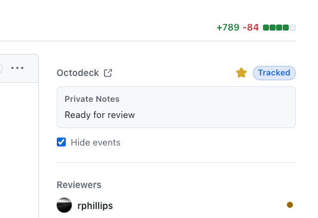

# OctoDeck (placeholder name)

> [!WARNING]
> This is an **alpha** project.
>
> If you encounter an issue or have feedback please file it [here](https://github.com/tallclair/octodeck/issues/new).

> [!CAUTION]
> **Single-User Security Model:** OctoDeck is designed strictly for individual maintainer use and does not provide multi-user isolation or authentication. Its security model relies entirely on network-level boundaries (such as binding to localhost or accessing via an SSH tunnel). Never expose the backend daemon directly to untrusted networks or shared environments.

**High-volume GitHub maintainer dashboard & companion toolkit.**

OctoDeck is a local-first triage dashboard and browser companion designed for maintainers and engineers managing high-volume open-source repositories.



---

## Why OctoDeck?

GitHub Notifications and Web UI were not designed for maintainers handling hundreds of pull requests and issues across multiple repositories every day. OctoDeck solves this with four core capabilities:

### 1. ⚡ Instant Speed via Local Caching

GitHub's web interface is unbearably slow, requiring multiple roundtrips and full page reloads to navigate between items, search, or view comments.

OctoDeck continuously synchronizes your notifications in the background and caches issues, PRs, comments, labels, and timeline state in a local embedded SQLite database (`~/.octodeck/octodeck.db`). Searching, filtering, and switching between items happens with **near zero latency**.

### 2. 🤖 Bot Noise Suppression & Timeline Cleaning

Kubernetes is flooded with CI bots, CLA checkers, retest slash commands, and automated labels that drown out human conversation.

OctoDeck automatically detects automated bots (`k8s-ci-robot`, `codecov`, `dependabot`, etc.) and slash commands (`/lgtm`, `/retest`, `/hold`), collapsing them into clean inline timeline summaries on both the dashboard and directly on GitHub, and suppressing notifications. Real human reviews and discussions are front and center.



### 3. ✅ Action-Oriented "Ack" Workflow

Treat your inbox as a TODO list. Items in the inbox may require attention, until they've been explicitly **Acknowledged (Acked)**. This is analogous to GitHub notifications "Done" concept, but intentionally separated.

* **Inbox (Action Required):** Contains items requiring your review, decision, or comment.
* **Acked (Waiting on Others):** Once you've handled an item, you **Ack** it. It moves out of your Inbox into the Acked bucket.
* **Auto-Unack on New Activity:** When a contributor pushes a new commit, leaves a comment, or requests your review, the item automatically pops back into your Inbox and New Activity views. Noise (bot comments, bot commands) do NOT un-ack items.
* **Auto-Ack on Your Activity:** When you submit a review, comment, or merge on GitHub, OctoDeck automatically acknowledges the item so you can move straight to the next task.
* **100% Local & Private:** Your triage state, bookmarks, and private maintainer notes are stored strictly on your local disk and never sent to GitHub or shared externally.

### 4. 📝 Personal Organization

GitHub doesn't provide many ways to organize items for your own personal triage. OctoDeck adds local tools to help manage your queue:

* **Private Notes & Stars:** Jot down private markdown notes and pin priority items to the top of your list (accessible from the dashboard or GitHub sidebar).

---

## Installation & Quickstart

### 1. Prerequisites

* **GitHub CLI (`gh`):** OctoDeck uses the GitHub CLI to securely authenticate with GitHub.
  * [Install GitHub CLI](https://cli.github.com/) if you haven't already.
  * Ensure `gh` is authenticated with the required scopes (`repo`, `read:org`, `notifications`):
    ```bash
    gh auth login -s read:org,notifications,repo
    ```

### 2. Install

Download the latest release assets from the **[Releases](https://github.com/tallclair/octodeck/releases/latest)** page:

#### Backend Daemon (Linux AMD64)

1. Download the pre-built executable binary:
   ```bash
   # Replace <version> with the desired version tag (e.g. v0.1.0)
   curl -LO https://github.com/tallclair/octodeck/releases/download/<version>/octodeck-<version>-linux-amd64
   chmod +x octodeck-<version>-linux-amd64
   mv octodeck-<version>-linux-amd64 octodeck
   ```
2. Start the daemon:
   ```bash
   ./octodeck serve
   ```
3. Open **`http://127.0.0.1:38274`** in your browser to access the dashboard (the web app is embedded directly into the daemon binary).

> [!NOTE]
> To build OctoDeck from source instead of using pre-compiled release binaries, see the **[Development Guide](docs/development.md#building-production-artifacts)**.

#### Companion Chrome Extension

1. Download and extract `octodeck-extension-<version>.zip`:
   ```bash
   unzip octodeck-extension-<version>.zip -d octodeck-extension
   ```
2. Open Google Chrome and navigate to `chrome://extensions/`.
3. Enable **Developer mode** using the toggle in the top-right corner.
4. Click **Load unpacked** in the top-left corner and select the extracted `octodeck-extension` directory.
5. The extension will automatically pair with your running `octodeck` daemon.

*(Optional)* A standalone bundle of the web assets (`octodeck-webapp-<version>.zip`) is also provided if you wish to host the web app on your own static web server instead of serving it from the Go daemon.

### 3. Optional: Install as a Background Service (Linux)

You can run OctoDeck as a persistent background service using systemd:

```bash
./octodeck install
```

This generates and enables a user-level systemd service (`octodeck.service`) that automatically starts when you log in.

* Check service status: `systemctl --user status octodeck.service`
* View logs: `journalctl --user -u octodeck.service -f`

### 4. Optional: Remote Development & SSH Port Forwarding

If you run the OctoDeck backend on a remote development machine or cloud workstation, forward port `38274` to your local machine:

```bash
ssh -N -L 38274:localhost:38274 user@remote-host
```

* **Web Dashboard:** Open `http://127.0.0.1:38274` in your local browser.
* **Companion Chrome Extension:** The extension installed in your local browser connects to `http://127.0.0.1:38274` and seamlessly communicates with the remote daemon over the SSH tunnel.

## Companion Chrome Extension Features

The OctoDeck Companion Extension brings maintainer controls directly into `github.com`.



#### What It Does

* **GitHub Right Sidebar Section:** Injects an OctoDeck section at the top of the right sidebar on PRs and issues for 1-click Ack/Unack, Star, and Private Notes.
* **Comment Form Quick-Ack:** Injects an Ack action directly next to GitHub's comment and review submission buttons.
* **Timeline Markers:** Visually highlights where you last viewed or acknowledged a discussion.
* **Bot Noise Collapser:** Automatically groups CI logs, bots, and slash commands into expandable pills.
* **Toolbar Badge & Desktop Notifications:** Displays live unread counts in your Chrome toolbar and delivers configurable OS-level notification alerts.

---

## Feature Overview & User Guide

* **Keyboard-Driven Triage:** Navigate your inbox with single keystrokes (`j`/`k` to navigate, `Enter` to open details, `x`/`e` to Ack with auto-advance, `s` to Star, `o` to open in GitHub, `?` for shortcut cheat sheet).
* **Multidimensional Filters:** Filter by PRs vs Issues, Open vs Closed, Organization & Repository, Author, Milestone, Labels, or Assigned to Me.
* **Maintainer Notes:** Write private, markdown-formatted notes on PRs and issues that persist across views.
* **Customizable Bot Rules:** Configure custom bot accounts and repository include/exclude wildcards (`kubernetes/*`, `!kubernetes/steering`).

For a detailed walkthrough, keyboard shortcut cheat sheet, and configuration options, see the **[User Guide](docs/user_guide.md)**.

For instructions on hacking on OctoDeck, running the Vite HMR dev server, and contributing code, see the **[Development Guide](docs/development.md)**.
